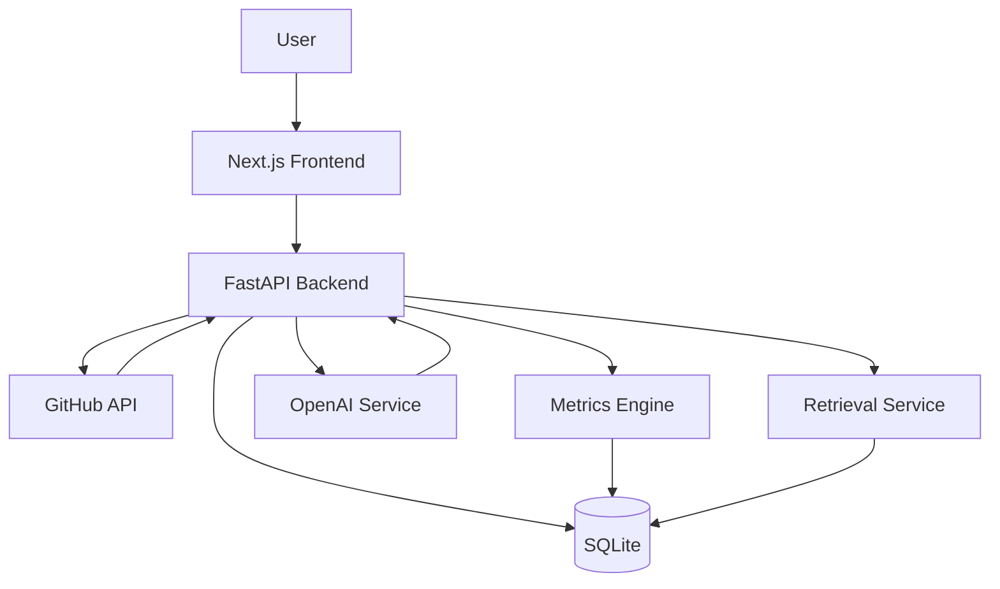

# RepoLens

AI-powered GitHub repository intelligence with engineering analytics, grounded insights, and interactive codebase chat.

## Product snapshot

RepoLens helps engineers and teams evaluate unfamiliar codebases quickly. It:
- fetches repository facts from GitHub,
- computes deterministic engineering metrics,
- generates a structured AI overview,
- stores analysis in SQLite for reuse,
- provides grounded Q&A against repo content.

## One-line architecture



## Structure

- `backend/` — FastAPI service, SQLAlchemy models, metrics/chat/overview services.
- `frontend/` — Next.js application and dashboard UI.
- `docker-compose.yml` — local local-compose stack for backend + frontend.

## Quick setup

```bash
cp backend/.env.example backend/.env
cp frontend/.env.local.example frontend/.env.local

python -m venv .venv
cd backend
source .venv/bin/activate
pip install -r requirements.txt
uvicorn app.main:app --reload

cd ../frontend
npm install
npm run dev
```

Or use Docker:

```bash
docker compose up --build
```

## API Endpoints

- `POST /api/repositories/analyze`
- `GET /api/repositories/{owner}/{repo}`
- `GET /api/repositories/{owner}/{repo}/metrics`
- `GET /api/repositories/{owner}/{repo}/activity`
- `GET /api/repositories/{owner}/{repo}/issues`
- `GET /api/repositories/{owner}/{repo}/contributors`
- `GET /api/repositories/{owner}/{repo}/files`
- `POST /api/repositories/{owner}/{repo}/chat`

## What to expect next

This scaffold is intentionally practical for iteration:
- complete tests and stronger validation remain to be added before production hardening,
- embedding generation currently supports deterministic fallback when OpenAI is unavailable.

## Progress log

See `CURRENT_PROGRESS.md` for what is already implemented in this pass and what remains.

## License

MIT
